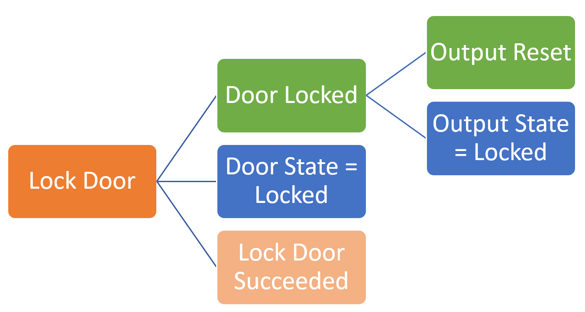

# Message Correlation

Real time messages passed from the service and the controller carry a messageId
and correlationId with messages being returned to the service also containing a
previousMessageId. These ids can be used to track causality through the system,
for example

1. User sends lock door command – This is the start of a sequence so a new
    correlation id is created. Every message gets a unique message id so that is
    created as well. As this is the start of a new sequence, previous message id
    is null.

2. Controller receives command – The controller locks the door, and sends back
    a CommandResponse message, a ‘Door Locked’ event and a state notification
    for the current state of the door, all these messages will get their own
    unique message id and will copy the correlation id and previous message id
    from the original command.

3. There is a custom event work-flow configured to operate an output when a door
    is locked, when the door is locked this fires from the door lock event and
    resets the output, this raises a state notification message for the new
    state of the output and an event (Output Reset) which again will get their
    own unique message id and this time will copy the correlation id and
    previous message id from the door locked event.

The use of the correlation id allows for easy lookup of all events related to
this sequence and the previous message id allows for the messages to be ordered.

